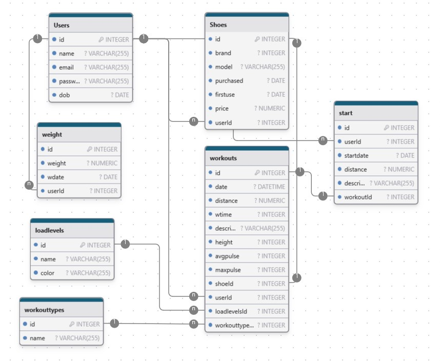

<a id="readme-top"></a>
# Training Log for a Running Club 

<!-- ABOUT THE PROJECT -->
## About The Project

Training Log system for running club to manage training logs and deliver detailed statistical insights for club members. 

### Technologies and libraries used

Technologies/libraries/packages used:

* Node.js - to build fast and easy web server and API library.
* Express - as a web application framework.
* SQLite - relational database to store project data.
* Embedded JavaScript (EJS) - simple templating engine to generate HTML.
* Bootstrap, jQuery, Chart - JavaScript libraries for HTML interface development.
* Sequelize -  to assist querying the database.
* Bcrypt - to hash passwords.
* Helmet - to secure Express apps by setting HTTP response headers.
* Cookie-parser - to parse HTTP request cookies
* Commander - to parse command line parameters.
* Jsonwebtoken - to securely transmit tokens.
* Cors - to control access to resources on different domains.
* Dotenv -to store and access securely app parameters, API keys, passwords.
* Swagger - API documentation

TODO:
* Jest - testing
* express-rate-limit - rate limit control

<p align="right">(<a href="#readme-top">back to top</a>)</p>

<!-- GETTING STARTED -->
## Getting Started

This is an example of how you may give instructions on setting up your project locally.
To get a local copy up and running follow these simple example steps.

### Installation
1. Clone this repository.
2. Install dependencies by running `npm install <package name>` for all packages `from package.json`.
3. Set environment parameters (PORT and database storage location) by edit `.env` file.
4. Run this command from application home directiory to create database and initialise tables.
```sh
node ./index.js --init
```
5. Run this command from application home directiory to load test data to the database from csv-file.
```sh
node ./index.js --data ./test-data.csv
```

### Run application.
Run this command from home directiory:
```sh
npm start
```
or
```sh
node ./index.js
```
<p align="right">(<a href="#readme-top">back to top</a>)</p>

## Usage
You can run the application in two ways:
* There is and html interface that can be accessed at `http://localhost:PORT/www/`
* And there is API available at `http://localhost:PORT/api/`
* For using ans API you need to login first.

## Functionality

### API Functionality and Entry-Points
API interface - CRUD operations for:
* `/api/users/` - Users
* `/api/workouts/` - Workouts
* Starts - TODO
* `/api/shoes/` - Running shoes statistics
Follow detailed API documentation at `/api/docs/` for more details.

### WWW Functionality
HTML interface:
* Users - Login, Logout, Registration - TODO
* Show workout statistics:
    ** Daily
    ** Weekly
    ** Monthly
* Running shoes statistics (milage) - TODO

Optional:
* Weight statistics (graph) - TODO
* Compare Start preparation activities for 2 different starts - TODO


## DB structure
Here is the database structure:


## Author

Alexander Zavialov

<p align="right">(<a href="#readme-top">back to top</a>)</p>
